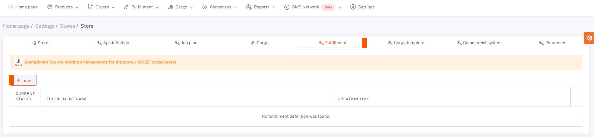
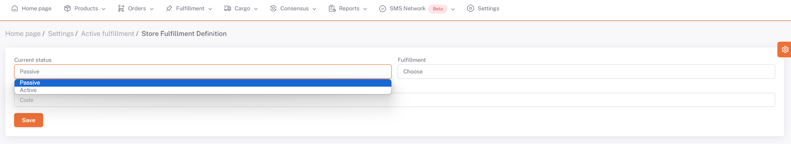

# Fulfillment

Mağazaya özel **fulfillment** tanımı buradan yapılır.

"**Yeni**" butonuna basılarak açılan ekranda durum ve **fulfillment bilgisi** seçilerek kaydedilir. 

**Aktif/Pasif**  olarak durum seçilir , **Fulfillment** sistemi seçilir , tanımladığımız **Kod** yazılır ve kaydedilir. 