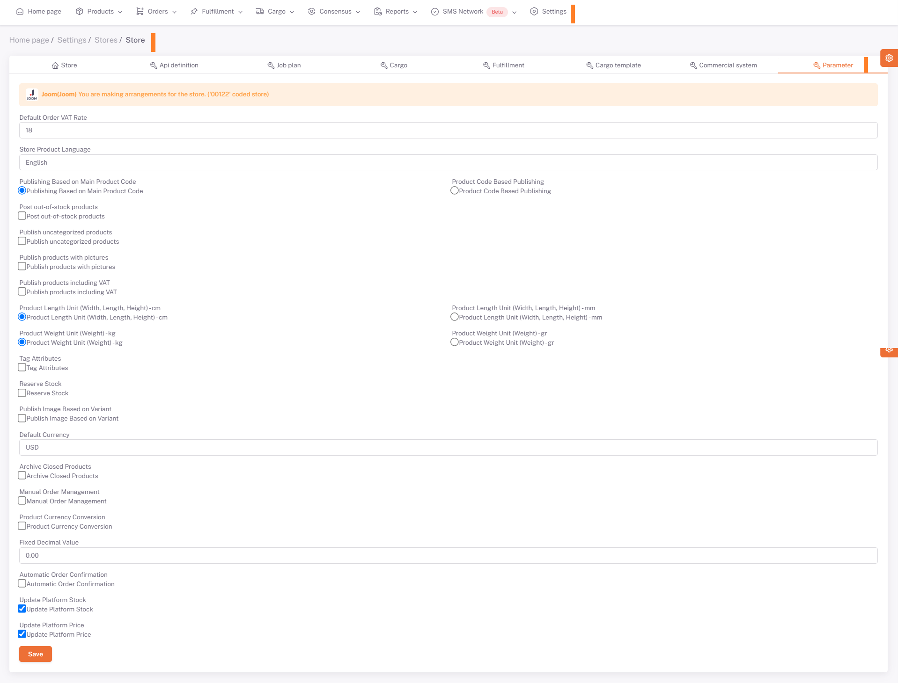

# parameter

**Default VAT rate** VAT tax rate on store basis,

**Store product language** product language published on my platform,

On the basis of **main product code**, the model code takes multiple products and groups them according to the basic product,

**Product Code** indicates the sub-variant of the main product code,

**Stock Code** code written on the special single code label for the product,

**Publish Out-of-Stock Products** Allows to publish non-stock products (shopify etsy publishes non-stock products, platforms check stock),

**Publish Uncategorized Products** Doesn't Categorize Products, Groups by Tag (valid on Shopify) ,

**Post Picture Products** Products with pictures are filtered and published,

**Publish Products Including VAT** Publications including taxation on products,

**Tag Attributes** to add attributes to the tag,

**Reserved Stock** reserved product stock can be kept,

**Variant Based Image Publishing** illustrates the variant of the products (valid for ozone shopify),

**Archive Closed Products** shopify archives the product when the stock is 0 and displays it again when the stock is available,

**Manually Order Management** is used to manualize the system and track it manually,

**Product Exchange Rate Conversion** converts supplier currency to sales currency,

**Fixed Decimal Value** adds the fixed decimal number entered at the end of the price,

Store-specific parameter definition is done here.

Parameters are the values that are taken as a basis when performing operations on the store.