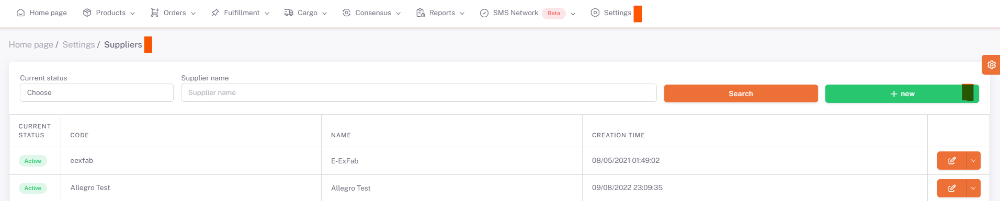
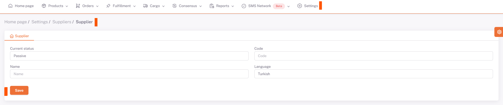
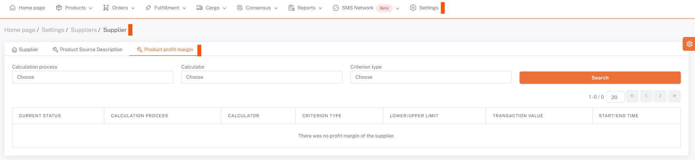

# Adding New Supplier

**Supplier** refers to the source of the products to be entered into the system.
To define a new **supplier**, go to the ***ShopiVerse Panel > Settings > Suppliers*** screen.

On the page opened by clicking the "**New**" button, the new supplier **information** is entered and the registration process is performed.

Status information is selected depending on whether the supplier is **active or passive**.

**Name and Code** definitions are made, the information **in which language** the source is selected is selected.

Then, by clicking the "**Save**" button, **new supplier** definition is made.

## Product Source Description

:::caution
In the "**Product Source Description**" tab on the screen that opens, there is information to be filled about the product source. This information is transmitted to ShopiVerse and defined by ShopiVerse.
:::

## Product Margin

The panel on the **Supplier Product Profit Margin** screen with information on how much and how Profit can be given to the Products over the Platforms.
You can **Search** by selecting *Calculation Transaction* **Profit/Discount** , *Calculation Type* **Percent/Fixed** , ***Criteria Type***.