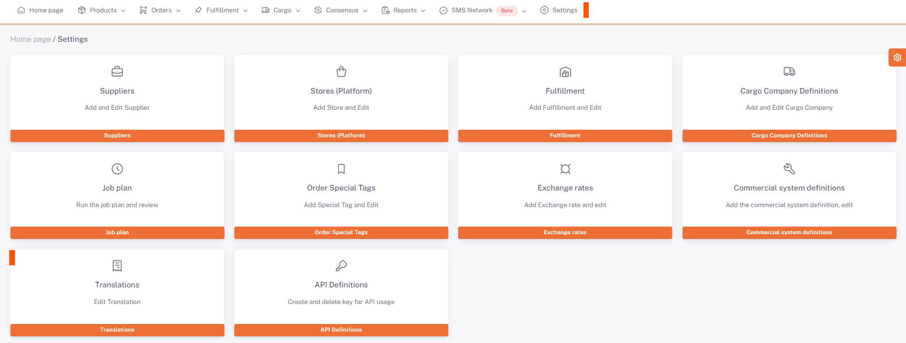

# Translations

All translations saved in the **ShopiVerse panel** are available on the **ShopiVerse panel > Settings > Translations** screen.

**Source Text** is the original text and **Target Text** is the translation of the original text.

It has the feature of making changes on the translations made.

After the Target Text to be changed is edited as desired, it is saved by pressing the button next to it.

Bulk changes can be processed by downloading the template from **Excel Transactions**.

:::caution
It will be used in the next process based on the edited version of the translation.
:::