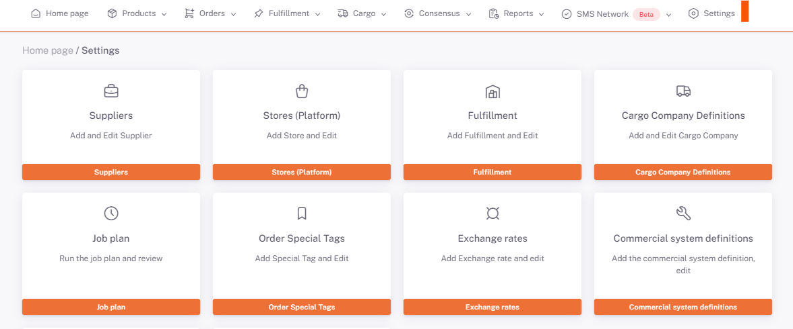
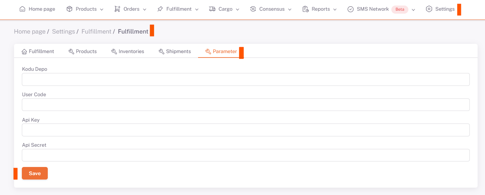

# Byrd Integration

## Byrd Support

**Api Key and Api Secret** information is requested from **Byrd support** screens.

https://developers.getbyrd.com/docs/obtaining-api-credentials (Detailed information is given on this link.)

## Settings > Fulfillment

The retrieved **Api Key and Api Secret** information is saved in the Parameter** tab in **ShopiVerse > Settings > Fulfillment settings.

## Edit

## Parameter

:::caution
Additionally, **Warehouse Code and User Code** parameters are needed. After **Api Key and Api Secret** information are defined, **Repository and User codes** are defined in the background by the ShopiVerse software team.
:::
 