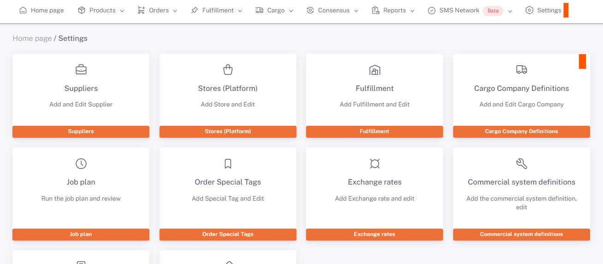
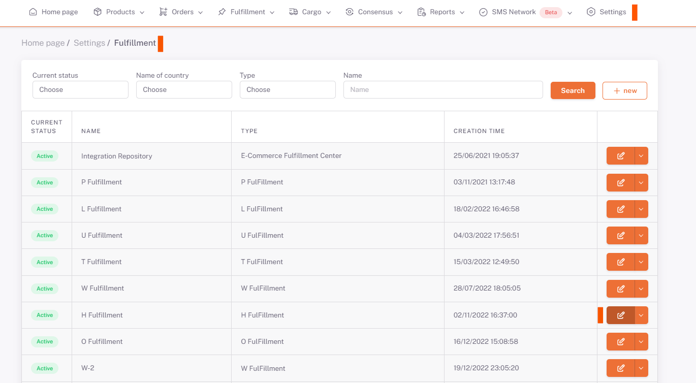
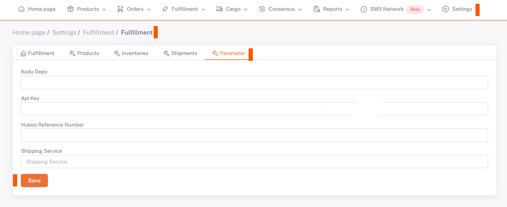

# Huboo Integration

## Huboo Account

A Huboo account is created from the link https://client.huboo.uk/register/account.

https://help.huboo.uk/en/support/solutions/articles/6000254795-setup-process-for-open-api-v2-0-sandbox This link has detailed information about installation.

After creating an account, clicking on the name on the **left side** of the screen opens the **account page**. By pressing the **Create button** under **Api Keys**, a new **Api Key** is obtained.

When the **Hub button** is clicked, the **Huboo Ref Code** appears.

## Settings > Fulfillment

***Api key and Ref Code*** are added as **ShopiVerse > Settings > FulFillment > Parameter**.
Also, the **Warehouse Code** parameter is needed. This code is defined in the background by the ShopiVerse software team.

## Edit

## Parameter

