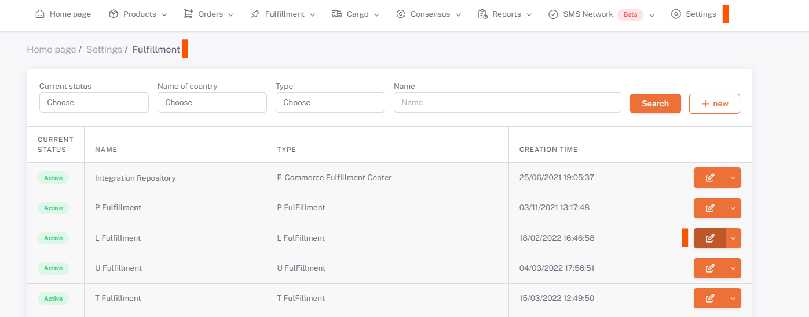

# Logsta Integration

## API Key

***Api Key*** information is received by Logsta. (This information is given by the Logsta team when the user is created.)

## Parameter

***Username, Password and Api Key*** information is saved in **Shopiverse > Settings > Fulfillment** *Parameter* tab.

:::caution
**Username and Password information** are the information used when logging into the **Logsta panel**.
:::

## Settings > Fulfillment

## Edit

## Parameter

:::caution
Additionally, Warehouse Code and User Code parameters are needed. After **User Name, Password and Api Key** information is defined, **Storage and User codes** are defined in the background by the ShopiVerse software team.
:::

 