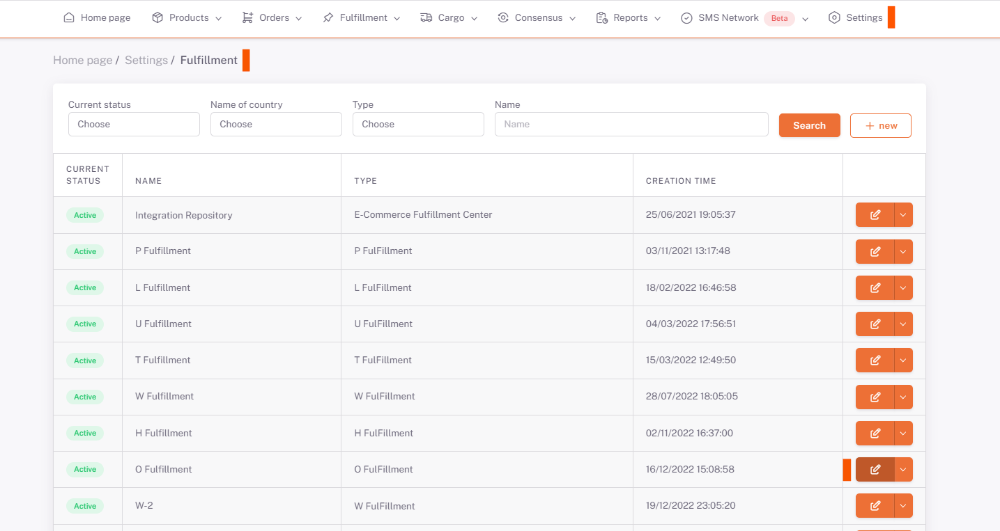
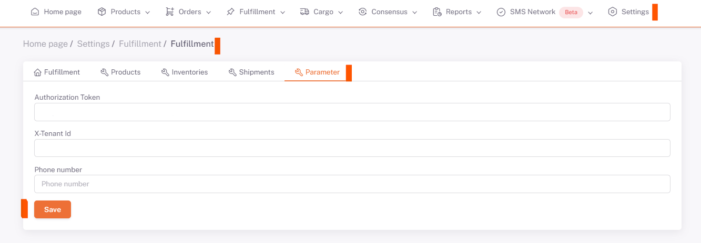

# Oplog Integration

## Parameter

***Authorization key , X-Tanant Id and Intagration Id*** **Shopiverse Panel > Settings > Fulfillment** Saved as *Parameter*.

## Settings > Fulfillment

## Edit

## Parameter

:::caution
***Authorization key and X-Tanant Id*** are given to you by the **Oplog** team.
If **Integrations -> My Integrations -> Shopiverse** is clicked on the panel, **Integration Id** appears on the screen that opens.
:::

 