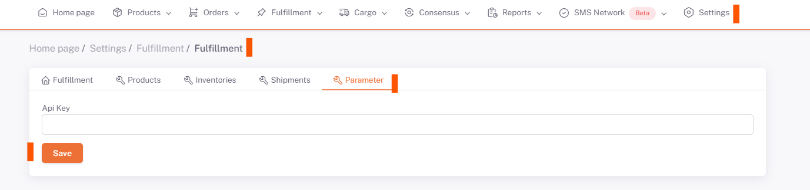

# Turland Integration

## API Key

**Api Key** information is obtained by filling the form at https://app.webshippy.com/settings/stores/add/webshippy-api url.

It is sufficient to fill in the **Store Name, Short Name and Store Url** fields on the form.

After these fields are filled and saved, the **Api Key** field on the form is filled automatically.

The **Api Key** information obtained from here is saved in the **ShopiVerse > Settings > Fulfillment** *Parameter* tab.

## Settings > Fulfillment

## Edit

## Parameter

 