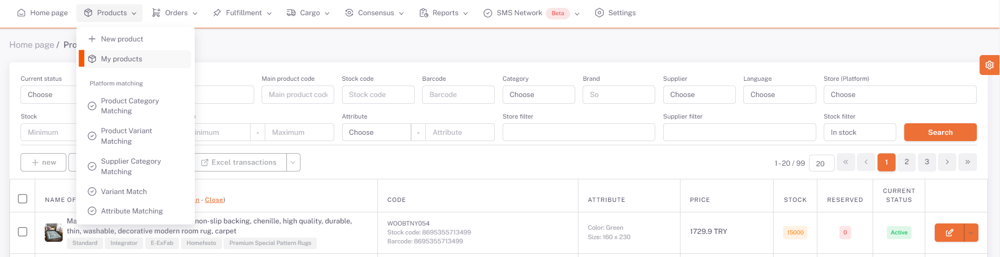
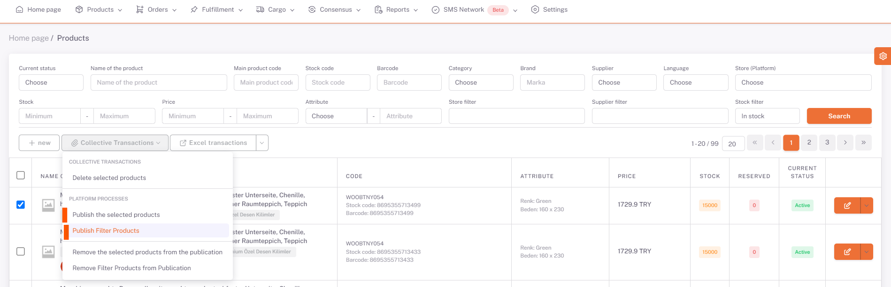
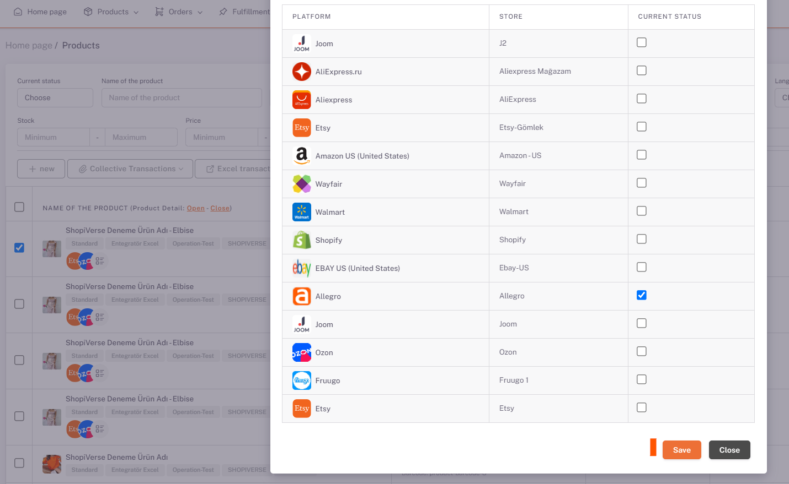
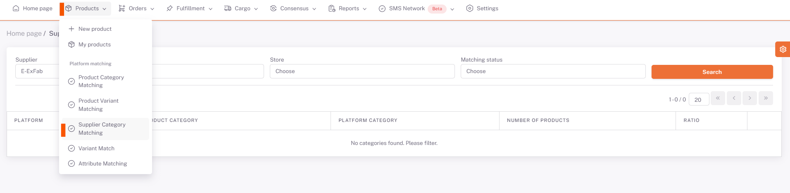
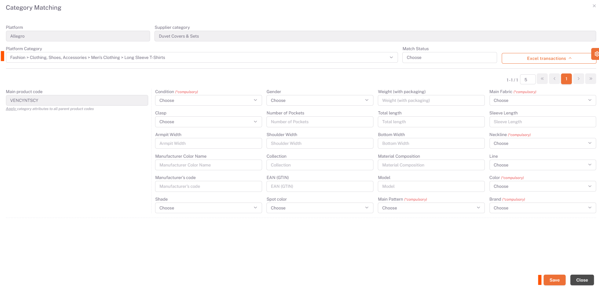
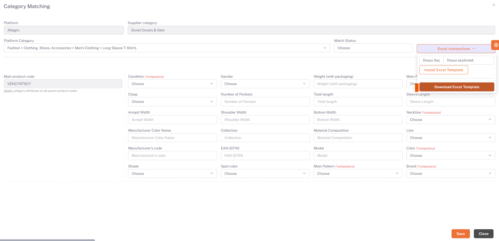

# Allegro Category Matching

On the My Products page, the products you want to be offered for sale are selected or *filtered* for **Allegro**.
## Products > My Products

## Platform Operations > Post Selected / Filtered Products
Then, under **Platform Operations**, “*Publish Selected Products*” or “*Publish Filtered Products*” option is selected, Allegro is selected on the pop-up page and Save is done.

## Category Matching

Then the **Products > Platform Matching > Supplier Category Matching** page is opened, Allegro is selected from the Store field, and the categories of your products that you have selected as available for sale are listed below.

## Edit

We open the category matching page with the edit button on the right side of the relevant category. You need to select the category that corresponds to your category written in the Supplier Category field in the Platform Category field here, or the category that is closest.

After selecting *Category*, your products and value fields requested by the platform are listed below on the basis of *Main Product Code*. In order for your products to be available for sale, you must fill in the "**Required**" values for each *Main Product Code*. After filling in these fields, we complete the category matching in all categories and products by clicking save.

Here, unlike other marketplaces, if you have color variants of the relevant Main Product Code in the "**Color**" matching field, you must select all the colors in this field as multiples.

## Excel Operations

In case you don't want to make the matches one by one, say "download **Excel Template**" under *excel operations in the right field* You must save the information by correctly filling in the columns corresponding to the *Main Product Codes* in the *Match Category* sheet. After you have prepared the Excel, you can perform the upload process on the same page in the ShopiVerse panel by saying “**Select File**” under excel operations, selecting the relevant excel and saying “**Upload Excel Template**”.