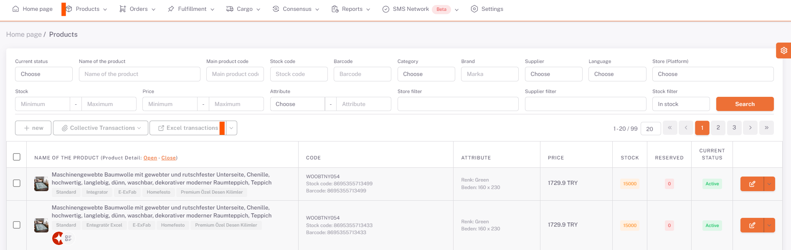

# Allegro Product Content and Price Customization

## Products > My Products > Excel Transactions

On the **Products** page, under *Excel Transactions*, in the “**Translate Product Information**” field, “*Source Language (in which language the products are in)*” and “*Target Language (in which language the products are intended to be translated)*” are selected and You will get the translated version of your product information with an excel output by selecting “*Download by Translating*” and clicking the download template button.

## Excel Operations > Translate Product Information

If there are any edits you want to make in this excel, the downloaded template will be restored by saying “*Choose File*” and “*Upload*” from the same place by making them, and your product information in the raw data will also contain information about the translated language.

## Allegro > Parameter

Then under **Settings > Stores > Allegro > Parameter** page, select “*Store Product Language*” in Polish or English.

## Excel Operations > Store Product Excel

After doing this, you can upload your excel from the same field by updating your price information and currency on excel by saying *Download Template* from Excel Transactions > Store Product Excel** section under **Products page.