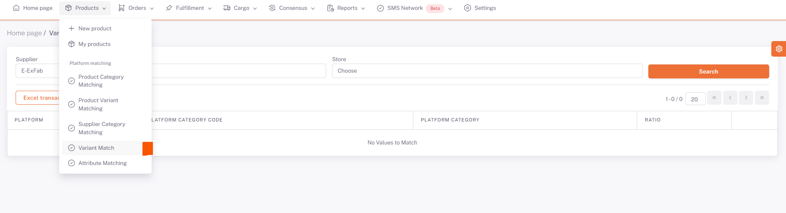

# Allegro Variant Matching
 
After the category matching is completed, the **Products > Platform Matching > Variant Matching** page opens. *Allegro* is selected from the *Store* field and the information of the categories you have matched the category is listed below.

## Variant Matching

We open the variant matching page with the *edit* button on the **right side** of the relevant category.

## Platform Attributes

On the page opened with the edit button corresponding to the **Attribute Value** field here, the appropriate value is selected from the corresponding attribute value offered by the platform by resetting the values with the “*Clear*” button and saying “*Search*”, and this is done for each attribute value.

Since we make the color matching on the category matching page, it will be sufficient to make only the size matching here.

