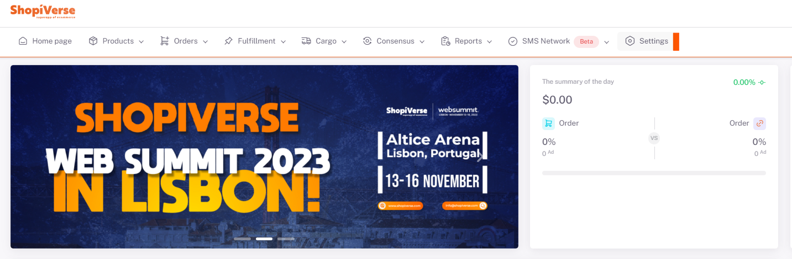
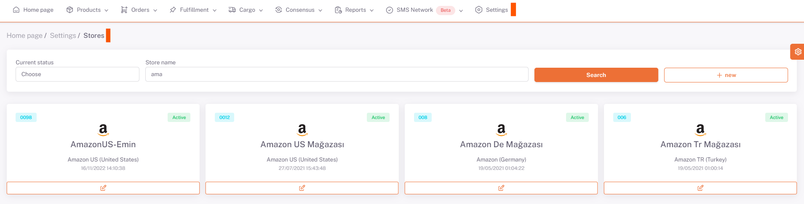
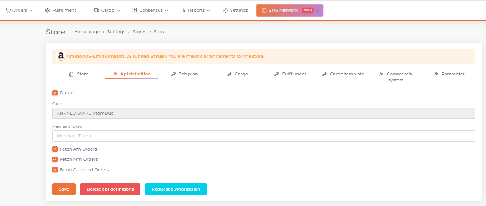

# Amazon API Integration

For **Amazon** API integration; We need to fill in the "**Merchant Token**" field under **Settings > Stores > Amazon > API Definition** from the ShopiVerse panel.

## Settings

 
## Stores > Amazon

## Amazon > API Definitions

## Merchant Token Almak İçin

To Get Merchant Tokens
On the https://sellercentral.amazon.com/hz/sc/account-information page, we need to enter this information in the "**Business Information > Merchant Token**" field and enter this information in the relevant field in the ShopiVerse panel.

Then by clicking on the "*Status*" section, we click "*Save*" and when the page is reloaded, the "**Request Authorization**" button will be created, by going to the Amazon panel, the user is logged in, the requested information is allowed and our api integration connection with Amazon is completed. .

:::caution

The point to be noted is that the language option in the ShopiVerse panel must be selected as Turkish when requesting authorization.

Note: A separate integration is required for each amazon country, so it is very important to make these api definitions specific to the correct marketplace.

:::
