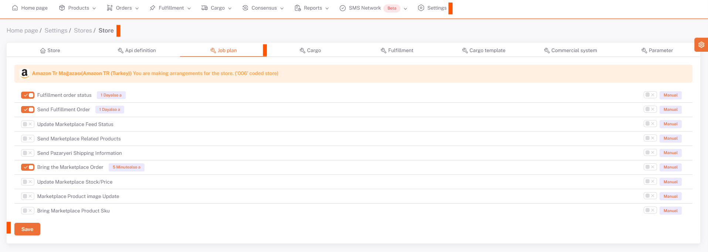

# Amazon Business Plans

After *category matching, variant matching, product content and price adjustments* are made for Amazon, you need to set the ***related business plans*** as *Manual/Auto* on the **Settings > Stores > Amazon > Business Plan** page and activate it. required.

## Settings > Business Plan

After doing this, the business plan with the side triangle symbol "**Opened from the Related Amazon Store**" under the Amazon tab under **Settings > Business Plan** is run.

:::caution
The business plans on the business plan page are the business plans activated from the stores, if they are not activated, check them again from the stores.

:::