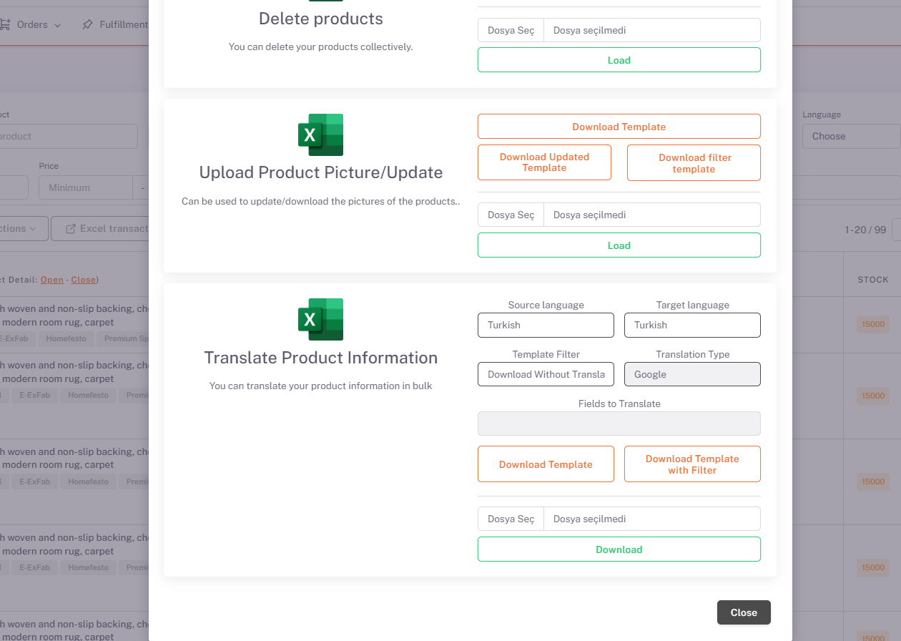
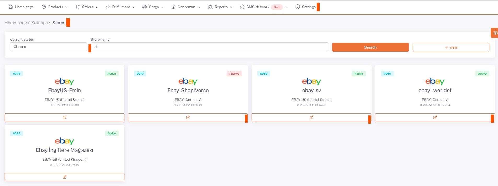
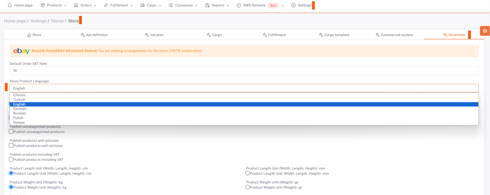
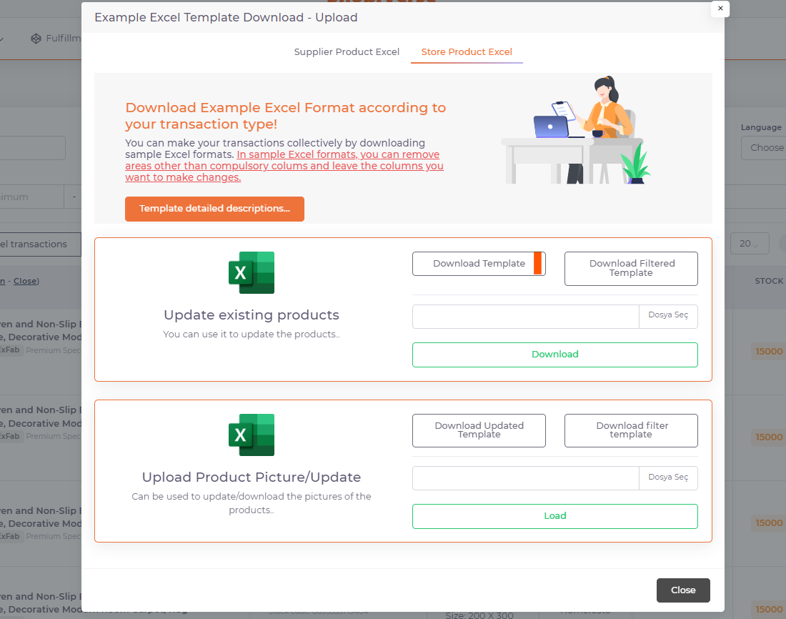

# Ebay Ürün İçeriği ve Fiyat Özelleştirme 

## Ürün Bilgilerini Çevirin

*Ürünler* sayfasında *Excel İşlemleri* altında “**Ürün Bilgilerini Çevirin**” alanında “**Kaynak Dil (ürünler hangi dilde ise)**” ve “**Hedef Dil (ürünler hangi dile çevrilmek isteniyorsa)**” seçenekleri seçilir ve “**Çevirerek İndir**” olarak seçilip şablon indir butonu ile ürün bilgilerinizin çevrilmiş halini excel çıktısı ile alırsınız. Bu excelde yapmak istediğiniz düzenlemeler olursa onları da yaparak aynı yer üzerinden “**Dosya Seç**” ve “**Yükle**” diyerek indirilen şablon geri yüklenir ve ham datadaki ürün bilgilerinizde çeviri yapılan dile ait bilgiler de oluşur. 

## Ebay > Parametre

### Mağaza Ürün Dili

Daha sonra **Ayarlar > Mağazalar > Ebay > Parametre** sayfası altında “*Mağaza Ürün Dili*” İngilizce olarak seçilir. 

## Excel İşlemleri > Mağaza Ürün Excel

Bu işlemi yaptıktan sonra yine Ürünler sayfası altında **Excel İşlemleri > Mağaza Ürün Excel** kısmından *Şablon İndir* diyerek excel üzerinde fiyat bilgilerinizi ve para birimini güncelleyerek yine aynı alandan excelinizi yükleyebilirsiniz. 

 

