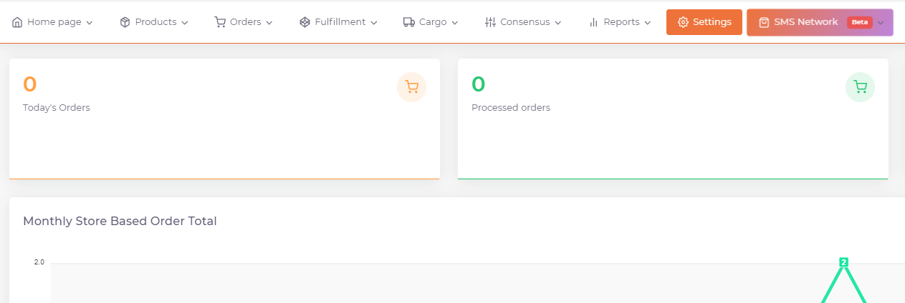
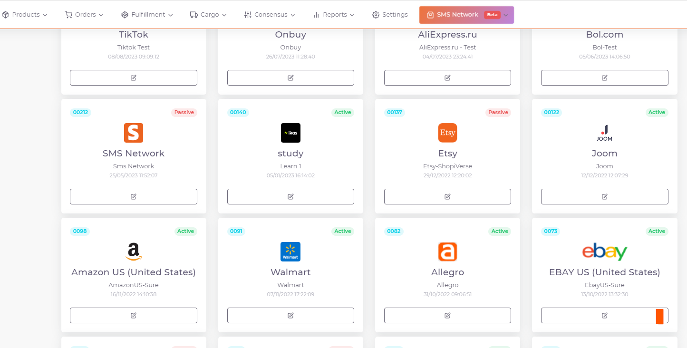
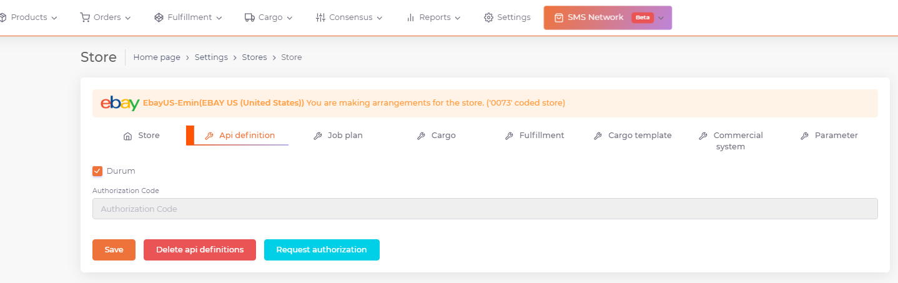

# Ebay API Integration

For **Ebay** API integration; From the ShopiVerse panel, click "**Status**" under **Settings > Stores > Ebay > API Definition** and click "**Save**" and click the "**Request Authorization**" button that will appear when the page is reloaded * By going to the *Ebay panel**, the user is logged in, the requested information is allowed and our api integration connection with Ebay is completed.

## Settings

 
## Stores > Ebay

## Ebay > API Definition

:::caution

Note: Go to the **Ebay panel** and log in as a user and allow the **requested information**.
The point to note is that the language option in the ShopiVerse panel must be selected as **Turkish** while requesting authorization.

:::