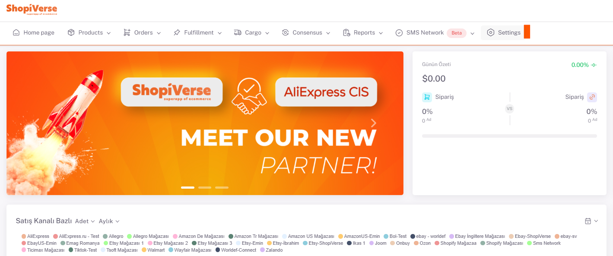
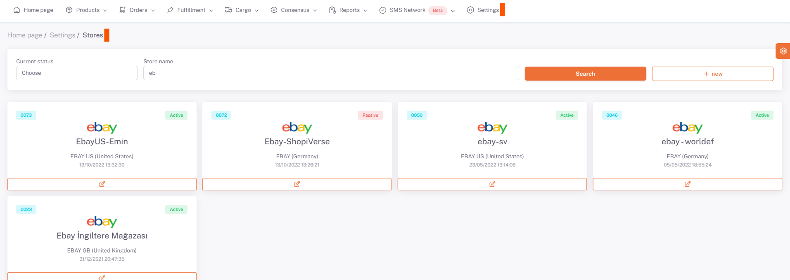
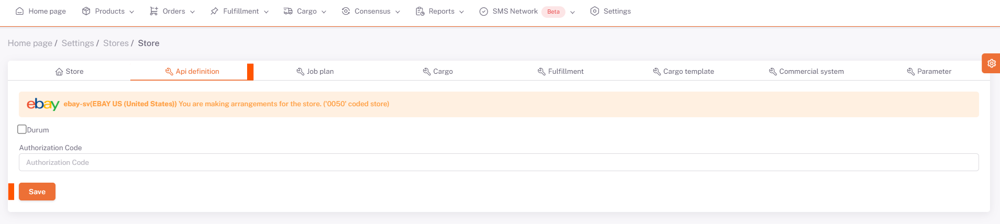

# Ebay API Entegrasyonu

**Ebay** API entegrasyonu için; ShopiVerse panelinden **Ayarlar > Mağazalar > Ebay >  API Tanımı** alanı altındaki “**Durum**” kısmını tikleyerek “**Kaydet**” diyoruz ve sayfa yeniden yüklendiğinde oluşacak “**Yetki Talep Et**” butonu ile **Ebay paneline** giderek kullanıcı girişi yapıp, istenilen bilgilere izin veriliyor ve Ebay ile api entegrasyon bağlantımız tamamlanmış oluyor. 

## Ayarlar

 
## Mağazalar > Ebay

## Ebay > API Tanımı

:::caution

Not: **Ebay paneline** giderek kullanıcı girişi yapıp, **istenilen bilgilere** izin veriniz.
Dikkat edilmesi gereken nokta, yetki talep edilirken ShopiVerse panelindeki dil seçeneği **Türkçe** olarak seçili olmalı.

:::