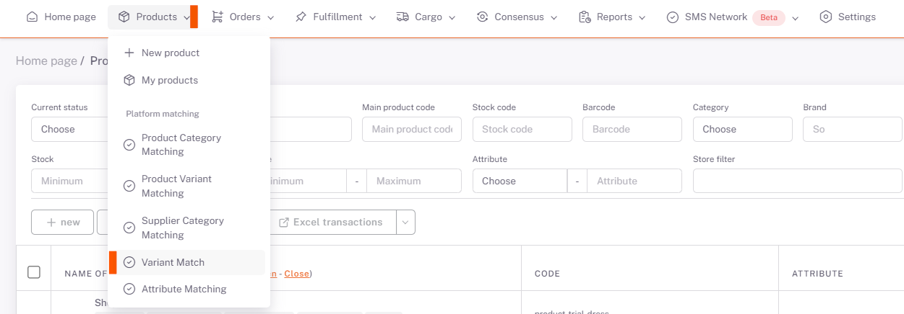

# Ebay Variant Matching

## Platform Matching

After the category matching is completed, the **Products > Platform Matching > Variant Matching** page opens. **Ebay** is selected from the *Store* field and the information of the categories you have matched the category are listed below.

## Edit

We open the **variant matching** page with the **edit** button on the right side of the relevant category. On the page opened with the edit button corresponding to the *Attribute Value* field here, reset the values with the "*Clear*" button and say "*Search*" and select the appropriate one from the corresponding attribute value offered by the platform, and this is done for each attribute value.

