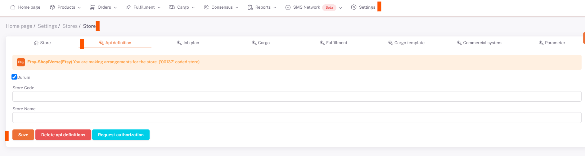

# Etsy API Integration

## Important Information and Things to Do Before the Integration Process

Etsy gives a total of **10 images** for each variant product, if your products have multiple colour variants, this may cause problems. You can learn detailed information by opening a ticket.
It is necessary to create **cargo template** in Etsy. You can provide transaction via "**Settings > Delivery Settings > Delivery Setting**" via Etsy panel.
Product size information (Width x Length x Height x Weight) must be entered correctly on the products in ShopiVerse. Products cannot be transferred to Etsy without size information.
 
For **Etsy ** API integration; From the ShopiVerse panel **Settings > Stores > Etsy > API Definition ** click the `Status` section under the field, and in the **Store name ** section (* not the store link "etsy. com/shop/xxxxx" only the store name "xxxxx "*) **Etsy by entering the name of your store to be exactly the same **, click the "**Save**" button and then click the "**Request Authorisation**" button that will occur when the page is reloaded, go to the *Etsy panel with the "**Request Authorisation**" button and log in to the user *, the desired information is allowed and our API integration connection with Etsy is completed. 

## Settings

 
## Stores > Etsy

## Etsy > API Definition

:::caution
Note Enter the name of your Etsy store in the **Store name** section, click the "**Save**" button and allow the requested information.
:::