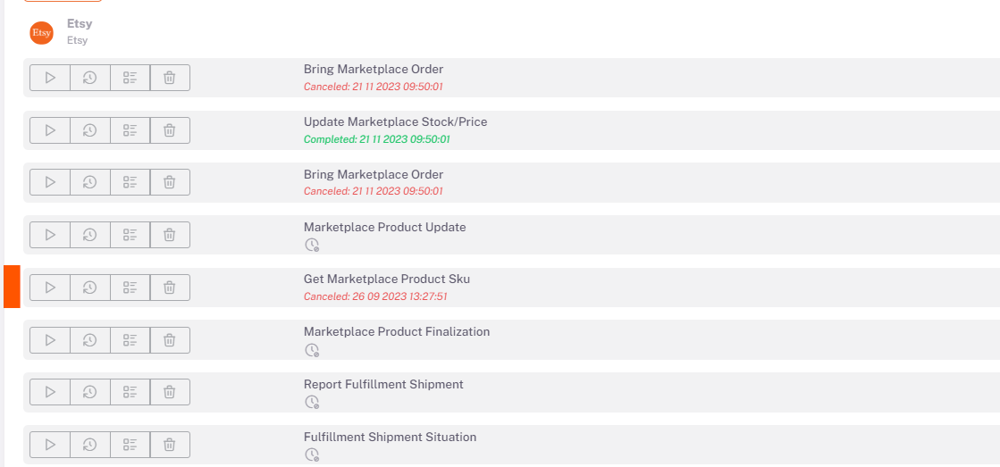

# Etsy Business Plans 

## Settings > Stores 

After *category matching, variant matching, product content and price edits* are made for *Etsy*, you need to determine and activate the ***related business plans*** as *Manual/Automatic* on the **Settings > Stores > Etsy > Business Plan** page. 

## Settings > Work Plan

After doing this process, the "*Marketplace Send Product*" business plan under the Etsy tab under **Settings > Business Plan** is run with the run button with *side triangle symbol*. After this business plan is completed, the "**Marketplace Stock/Price Update**" business plan is run in the same way. 

## Etsy Product Matching

If you already have products listed in Etsy, integration connection can be provided by matching these products with your products listed in ShopiVerse.
The sku's of your products in Etsy and the **stock codes** of the products listed in ShopiVerse must be exactly the same.
If this condition is met; **Settings > Business Plans > Etsy > Marketplace Product SKU** You can match the products by running the Fetch task.

:::caution
As a result of the business plans, you need to re-run the business plan by examining the product-based error messages given in the form of errors or warnings and making the necessary corrections. 

After these processes, the products that are successfully sent according to the results of the business plans are successfully opened for sale on Etsy. 
:::