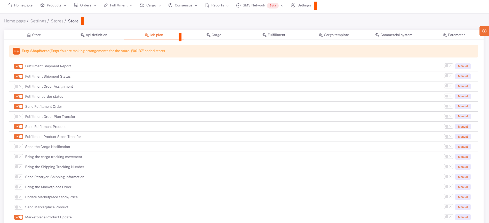
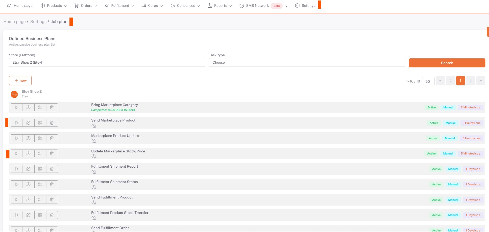

# Etsy Business Plans

## Settings > Stores

For *Etsy*, after *category matching, variant matching, product content and price adjustments* are made, on **Settings > Stores > Etsy > Business Plan** page, ***related business plans*** are set as *Manual/Automatic* and activated you need to make it.

## Settings > Business Plan

After doing this, the business plan “*Send Products* to Marketplace*” under the Etsy tab under **Settings > Business Plan** is run with the run button with the *side triangle symbol*. After this business plan is completed, the "**Marketplace Stock/Price Update**" business plan is run in the same way.

:::caution
As a result of the work plans, you should review the product-based error messages that are given as errors or warnings and make the necessary corrections and run the work plan again.

After these processes, the products that are sent successfully according to the results of the business plans are successfully opened for sale on Etsy.
:::