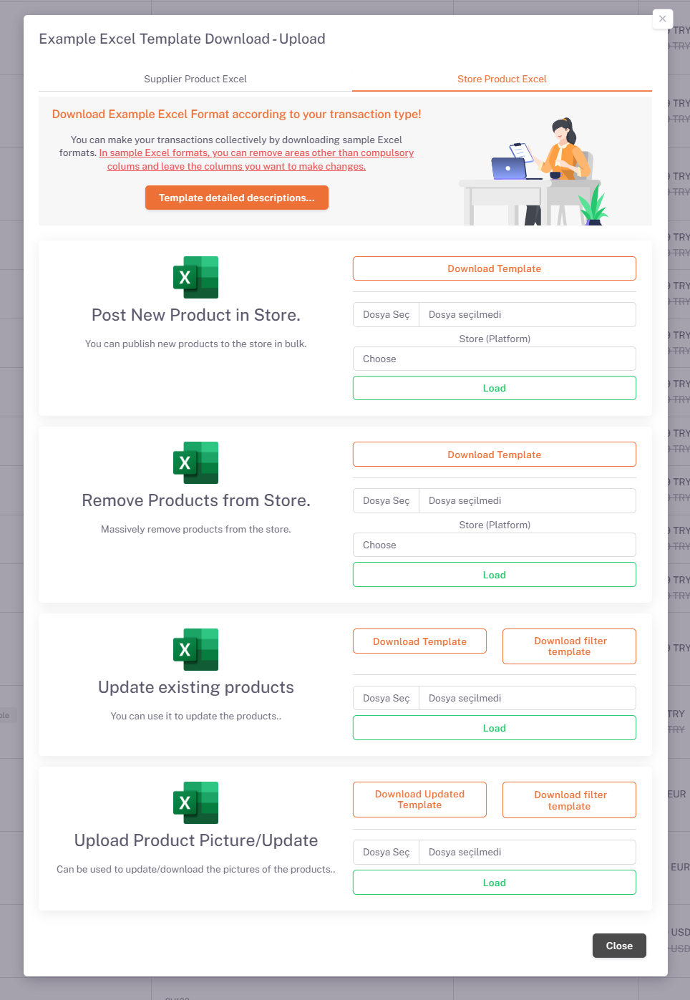

# Etsy Product Content and Price Customization

## Products > Excel Operations

On the *Products* page, under **Excel Transactions**, in the "**Translate Product Information**" field, "**Source Language (whichever language the products are in)**" and "**Target Language (to which language the products are intended to be translated)** ” options are selected and “*Download by Translating*” is selected and you will receive the translated version of your product information with an excel output by clicking the download template button.

If there are any edits you want to make in this excel, the downloaded template will be restored by saying “*Choose File*” and “*Upload*” from the same place by making them, and your product information in the raw data will also contain information about the translated language.

## Parameters

Then, under **Settings > Stores > Etsy > Parameter** page, “*Store Product Language*” is selected in English.

After doing this, you can upload your excel from the same field by updating your price information and currency on excel by saying *Download Template* from Excel Transactions > Store Product Excel** section under **Products page.