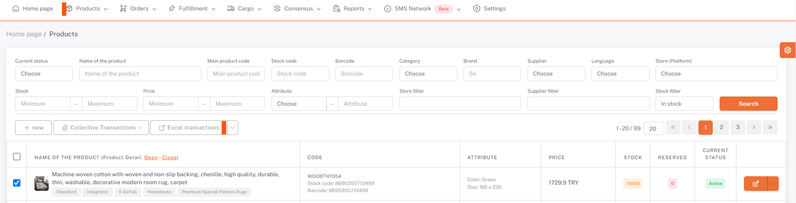
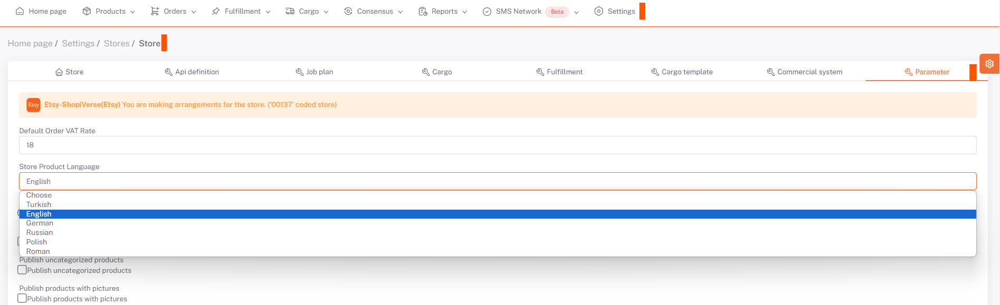

# Etsy Product Content and Price Customisation 

## Products > Excel Operations

On the *Products* page, under **Excel Operations**, in the "**Translate Product Information**" field, "**Source Language (in which language the products are in)**" and "**Target Language (in which language the products are to be translated)**" options are selected and "*Download by Translating*" is selected and you will receive the translated version of your product information with excel output with the template download button. 

***Product names and descriptions must be entered in English for products. In the same way, product size information must also be entered.

If there are any edits you want to make in this excel, by making them, the downloaded template is restored by saying "*Select File*" and "*Load*" from the same place and the information of the translated language is also formed in your product information in the raw data. 

## Parameters

Then under **Settings > Stores > Etsy > Parameter** page "*Store Product Language*" is selected as English. 

After doing this process, you can upload your excel from the same area by updating your price information and currency on the excel by saying *Download Template* from the **Excel Operations > Store Product Excel** section under the **Products** page.