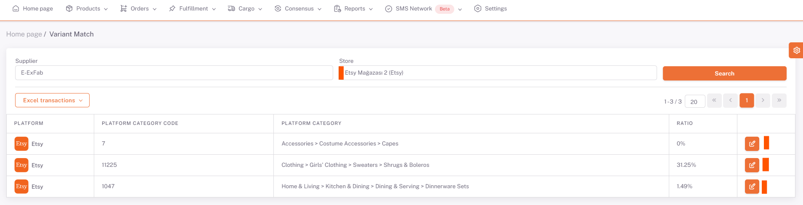
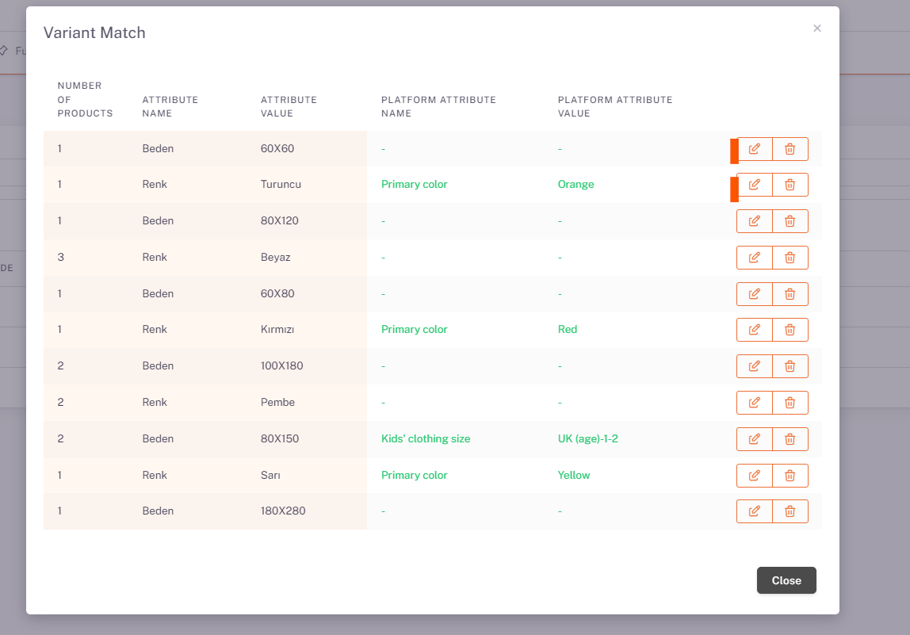
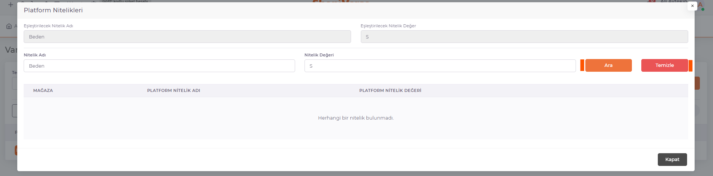

# Etsy Variant Matching

## Platform Matching > Variant Matching

After the *Category matching* is completed, the **Products > Platform Matching > Variant Matching** page opens. *Etsy* is selected from the Store field and the information of the categories you have matched the category is listed below.

## Edit

We open the *variant matching* page with the *edit* button on the right side of the relevant category. On the page opened with the edit button corresponding to the Attribute Value field here, reset the values with the "**Clear**" button and say "**Search**" and select the appropriate value from the corresponding attribute value offered by the platform, and this is done for each attribute value.

