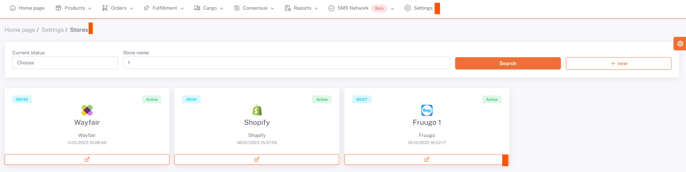

# Fruugo API Integration

For **Fruugo** API integration; We provide order integration by entering your “`Username`” and “`Password`” information under **Settings > Stores > Fruugo > API Definition** from the ShopiVerse panel.

## Settings

 
## Stores > Fruugo

## Fruugo > API Definition

For **product shipping and stock price updates**, we transfer our products to Fruugo by sending a feed after category matching is done.

:::caution

Note: In order to make the first product submissions here; They want product transfer to be at least 50% of the number of sku entered in the "Number of products to list on Fruugo" field while opening a marketplace account. You must act accordingly.

:::