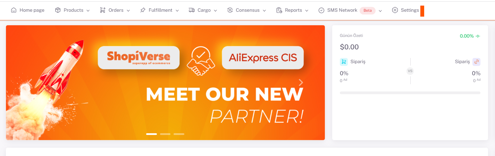

# Fruugo API Integration

## Things to Do and Important Information Before the Integration Process

Before you start listing products on Fruugo, Shipping Method settings must be made on the panel.
You must declare the currency you want to sell your products in and define your bank information according to the relevant currency.

## Fruugo API Integration

**Fruugo** For API integration; We ensure order integration by entering your "Username" and "Password" information under the **Settings > Stores > Fruugo > API Definition** field from the ShopiVerse panel.

## Settings

 
## Stores > Fruugo

## Fruugo > API Description
For **Fruugo API integration**; The following fields must be filled in under **Settings > Stores > Fruugo > API Definition** from the ShopiVerse panel.

**For product shipping and stock price updates**, we transfer our products to Fruugo by sending a feed after category matching.

:::caution

**Merchant Code**: You must enter your Fruugo Retail ID information in this field. You can find this information in the Fruugo panel under the “**Account Settings > Company Details**” page.
**Username**: The email address you use to log in to your Fruugo account.
**User Password**: The password information with which you log in to your Fruugo account
After entering this information, you can complete the process by clicking the Save button. Afterwards, ShopiVerse will provide the integration link by sending the webhook link to the Fruugo technical team.

:::