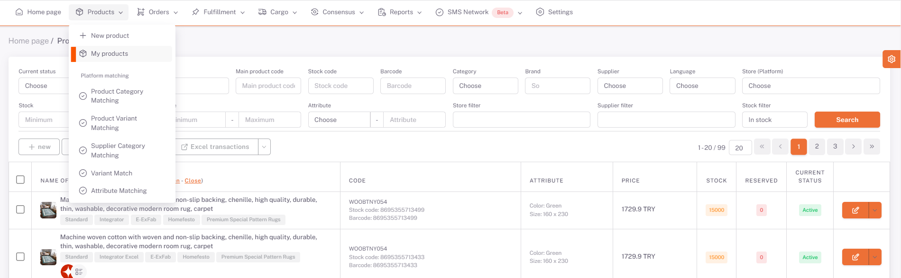

# Fruugo Category Matching

## Products > My Products

On the My Products page, the products you want to be offered for sale on *Etsy* are selected or filtered. Then, select “**Publish Selected Products**” or “**Publish Filtered Products**” option under **Platform Transactions**, select **Fruugo** on the pop-up page and *Save*.

## Supplier Category Matching

Then, the **Products> Platform Matching > Supplier Category Matching** page opens, select *Fruugo* from the *Shop* field and the categories of your products that you have selected as available for sale are listed below.

We open the category matching page with the edit button on the right side of the relevant category. Here, you need to select the *Platform Category* field that corresponds to your category written in the *Supplier Category* field, or the closest category.

After selecting the category, your products and the value areas requested by the platform are listed below based on the Main Product Code. In order for your products to be available for sale, you must fill in the "Required" values for each Main Product Code. After filling in these fields, we complete the category matching in all categories and products by clicking save.