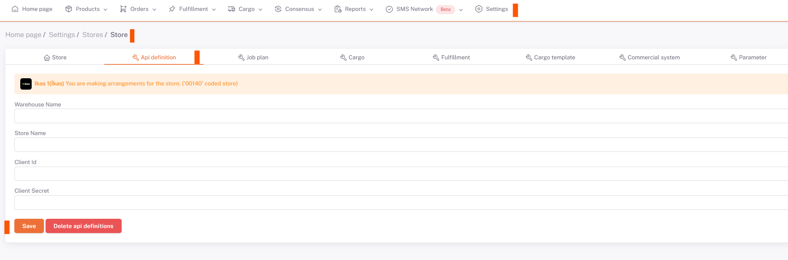

# Ikas API Integration

**Ikas** for API integration; From the ShopiVerse panel, we need to fill in the “`Client Secret`” and “`Client ID`” information under **Settings > Stores > IQ > API Definition**.

## Required Information for Integration
 
For this **https://accounts.ikas.com/register/t?_gl=1*2iosec*_gcl_au*MTkwMTEzODk4OC4xNjg1OTg3ODUz**
Go to the address and register by filling in the necessary information. Then click on the **'Login'** button to log in to the account.

Click '**My Apps**' from the *left panel*, then click '**Add to My Application' from the *main screen* > 'Manage Your Custom Applications**'.

On the screen that opens, click the **'Create Custom Application'** button in the upper right corner. In the window that opens, *required information* is filled and *permissions* are selected.

When the information is saved, **Client Id and Client Secret** are created. This information is entered in the required fields on the *ShopiVerse panel* on the **Settings > Stores > Ikas > Api Definition** page.

**Store Name and Warehouse Name** information is also required here. If you have not created any repository, you should write **'Main Repository'** in this section.

