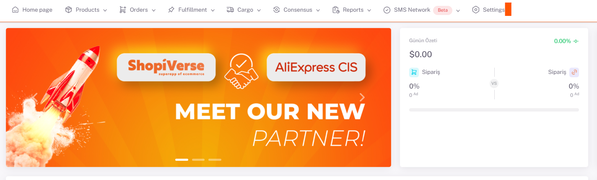
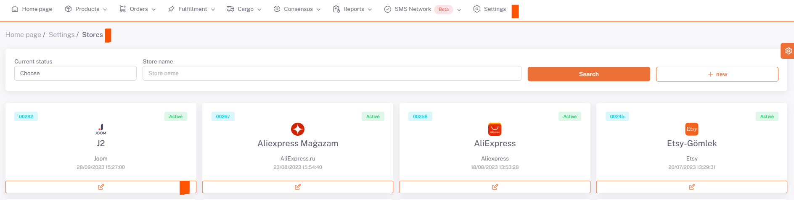
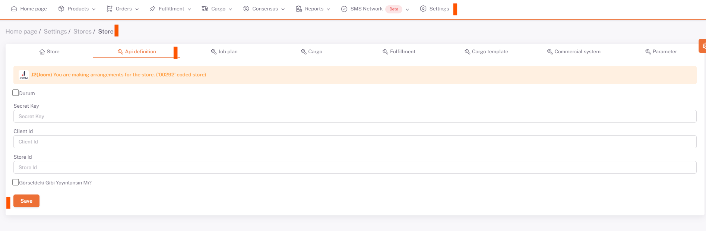

# Joom API Integration

For **Joom** API integration; We need to fill in the “`Secret Key`” and “`Client ID`” information under the **Settings > Stores > Joom > API Definition** field from the ShopiVerse panel.

## Settings

 
## Stores > Joom

## Joom > API Definition

## Required Information for Integration
 
For this, we create a store with “**Open New Store**” under the address https://merchant.joom.com/panel/stores and then click on the store name we created and go to the store detail page, here in the “**General Information**” field. Copy the **code** written under the “**ID No**” and paste it into the **StoreId** section of the *Shopiverse Store API Description*.

Then, we go to the "**API Applications**" page in your account information area at the top right of the Joom panel. Here we click on the “**Create New Application**” button. Here we select the store you created in the "**ShopiVerse**" Store section in the Title section. In the “**Redirect URL**” field, we write “`https://app.shopiverse.tech/tr/settings/store/joomcallbackcode`” and click save.

Then, on the page that opens, by clicking on the **title name**, the "**Customer Identification Number**" field on the page opened; We enter the “**Secret Key**” field in the “**Secret Key**” field in the ShopiVerse panel and click on the Status section and click save.

Then, when the page is reloaded, the "**Request Authorization**" button will be created, by going to the Joom panel, the user is logged in, the requested information is allowed and our api integration connection with Joom is completed.