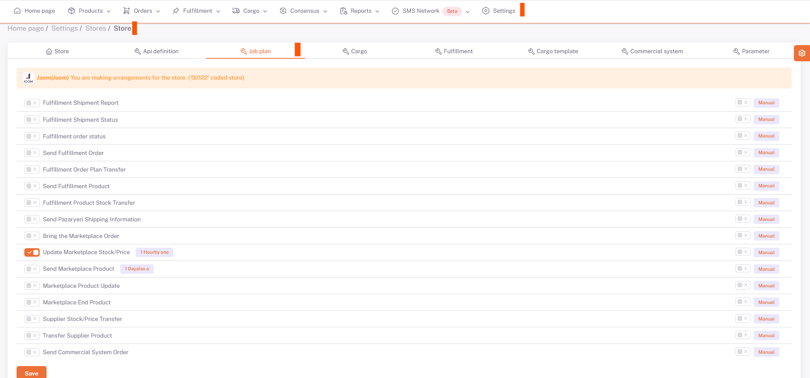
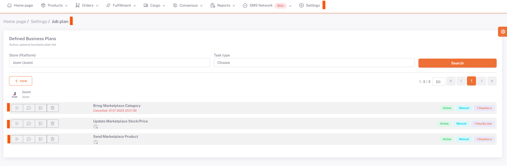

# Joom Business Plans

## Joom > Business Plan

After **category matching, attribute matching, product content and price adjustments** for *Joom*, you can set the ***related business plans*** *Manual/Automatic* on **Settings > Stores > Joom > Business Plan** page. You need to set it and activate it.

## Settings > Business Plan

After performing this operation, the "**Send Products**" business plan under the Joom tab under **Settings > Business Plan** is run with the run button with the *side triangle symbol*. After this business plan is completed, the "*Update Marketplace Stock/Price*" business plan is run in the same way.

:::caution
As a result of the work plans, you should review the product-based error messages that are given as errors or warnings and make the necessary corrections and run the work plan again.

After these processes, the products that are sent successfully according to the results of the business plans are successfully opened for sale in the Joom marketplace.
:::