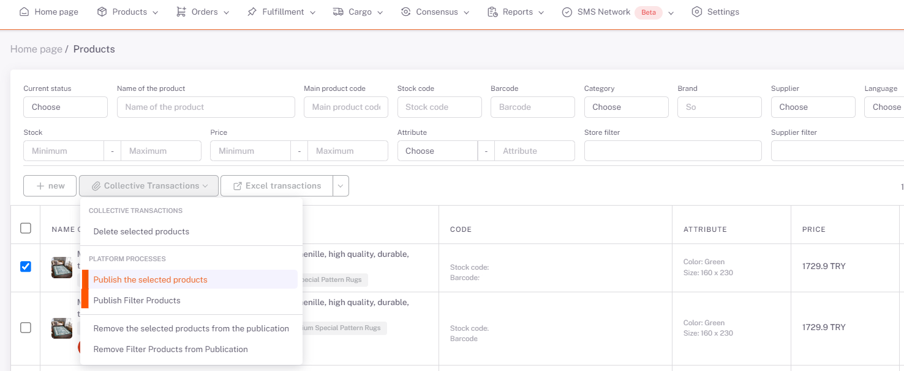
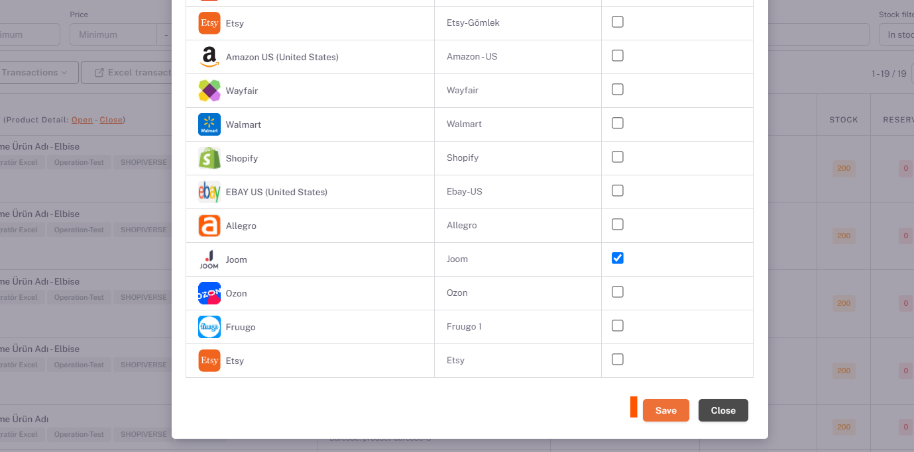
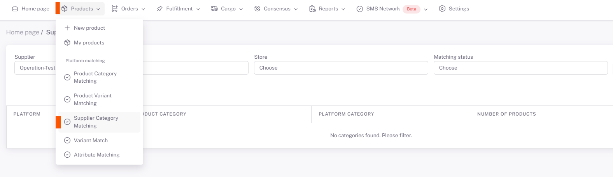
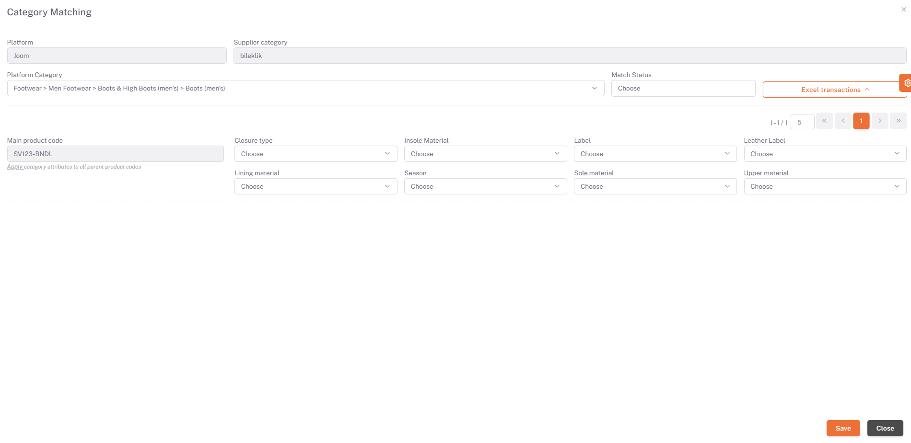

# Joom Category Matching

## Products > My Products

On the *My Products* page, you can select or filter the products that you want to be offered for sale in Joom. Then, under **Platform Operations**, “**Publish Selected Products**” or “**Publish Filtered Products**” option is selected, Joom is selected on the pop-up page and Save is done.

## Category Matching

Then **Products > Platform Matching > Supplier Category Matching** page opens, **Joom*** is selected from the *Store field and the categories of your products that you have selected as available for sale are listed below.

## Edit

We open the category matching page with the edit button on the right side of the relevant category. In the *Platform Category* field here, you need to select the category that corresponds to your category written in the *Supplier Category* field or the closest category.

After selecting the category, your products and value fields requested by the platform are listed below on the basis of the Main Product Code. In order for your products to be available for sale, you must fill in the "Mandatory" values for each Main Product Code. After filling in these fields, we complete the category matching in all categories and products by clicking save.

If you do not want to make the matches one by one, click "Download *Excel Template*" under excel operations in the right field and enter the required value fields in the columns corresponding to the Main Product Codes in the Category Match sheet. You must fill it in correctly and save it. After you have prepared the Excel, you can select the relevant excel by saying “*Choose File*” under excel operations on the same page in the ShopiVerse panel, and then click “*Load Excel Template*” and perform the upload process.