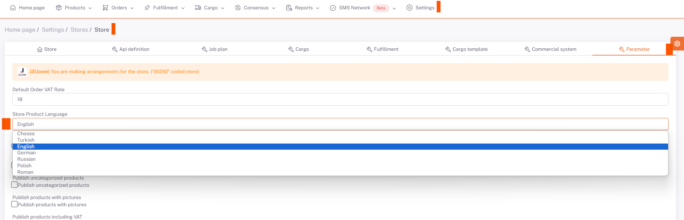

# Joom Product Content and Price Customization

## Excel Operations

In the "**Translate Product Information**" field under Excel Transactions on the *Products* page, the "**Source Language (in which language the products are in)**" and "**Target Language (whichever language the products are intended to be translated into)**" options are selected, and You will get the translated version of your product information with an excel output by selecting “*Download by Translating*” and clicking the download template button.

If there are any edits you want to make in this excel, the downloaded template will be restored by saying “*Choose File*” and “*Upload*” from the same place by making them, and your product information in the raw data will also contain information about the translated language.

## Parameter

Then, under **Settings > Stores > Joom > Parameter** page, “*Store Product Language*” is selected in English.

After doing this, you can upload your excel from the same field by updating your price information and currency on excel by saying *Download Template* from Excel Transactions > Store Product Excel** section under **Products page.

