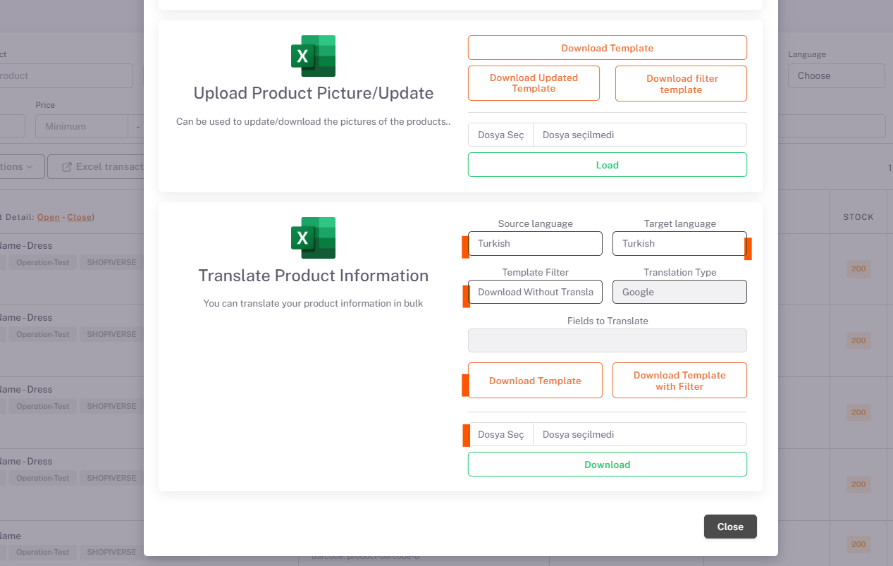

# Joom Product Content and Price Customization

## Excel Operations

In the "**Translate Product Information**" field under Excel Transactions on the *Products* page, the "**Source Language (whatever language the products are in)**" and "**Target Language (whatever language the products want to be translated into)**" options are selected and By selecting “*Download by Translating*” and clicking the download template button, you will receive the translated version of your product information as an Excel printout.

If there are any edits you want to make in this Excel, you can make them and click "*Select File*" and "*Upload*" in the same place. The downloaded template will be restored and the product information in the raw data will also contain information about the translated language.

## Parameter

Then, under the **Settings > Stores > Joom > Parameter** page, “*Shop Product Language*” is selected as English.

After completing this process, you can update your price information and currency on Excel by clicking *Download Template* from the **Excel Transactions > Store Product Excel** section under the Products page and upload your Excel from the same area. It is important to enter product measurement information correctly in the product contents. According to this information, Joom determines the sales price by subtracting a shipping cost and adding the shipping cost to the sales price you set for the product.

