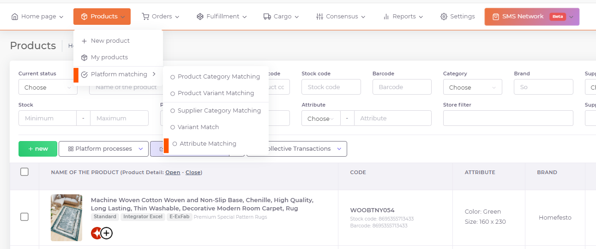
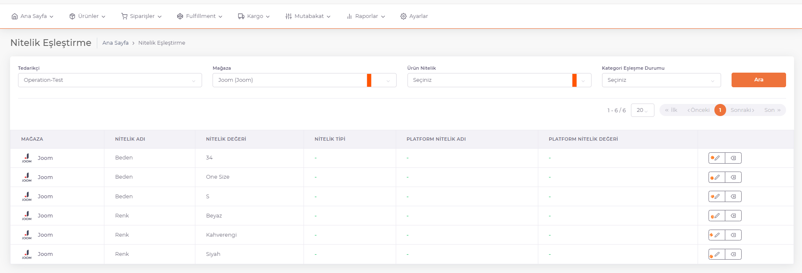
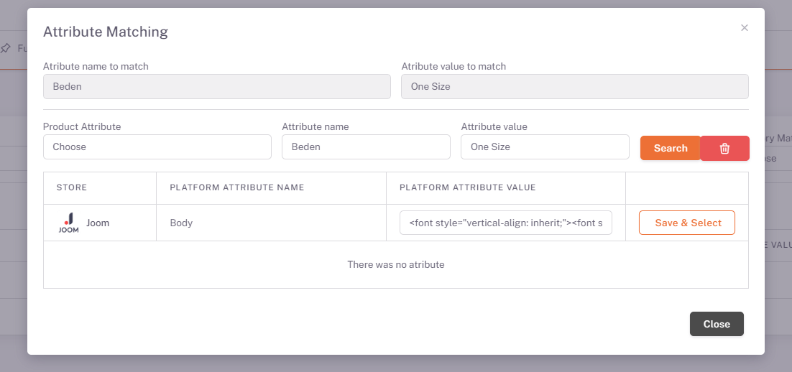

# Joom Attribute Matching

## Attribute Matching

After *category matching* is completed, the **Products > Platform Matching > Attribute Matching** page opens. Joom is selected from the Store area and color and size information with attribute values are listed below.

We open the attribute matching page with the **edit** button on the right side of the relevant attribute value.

On the page opened with the edit button corresponding to the Attribute Value field, the values are reset with the "**Clear**" button and the appropriate one is selected from the attribute value equivalents offered by the platform by clicking "**Search**" and this is done for each attribute value. You can match the color values by typing "as the picture". After this process, you can put your products on sale with the "As in the picture" option in different visual / color variations to be published on Joom.

