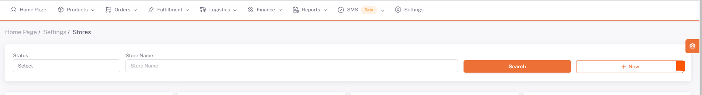
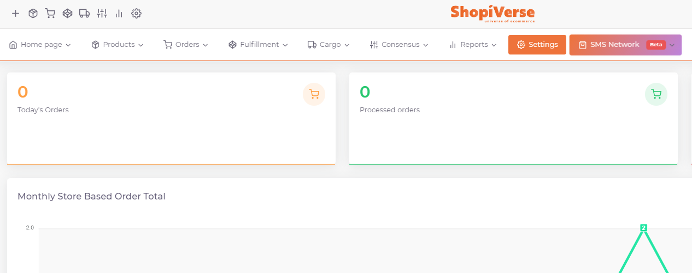
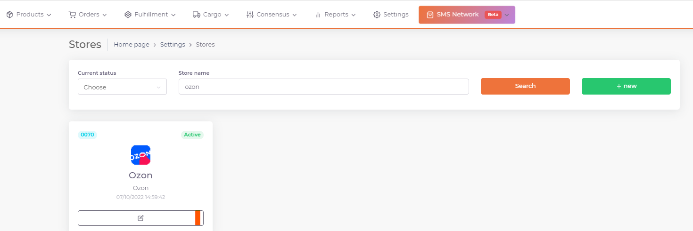
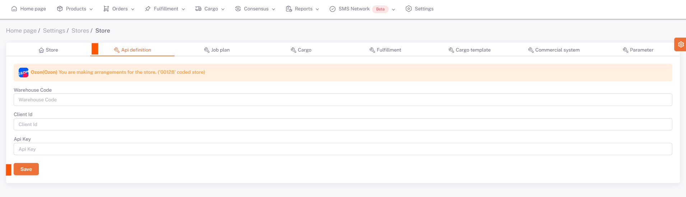
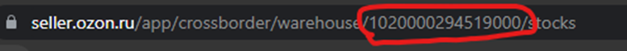

# Ozone API Integration

## Things to Do and Important Information Before the Integration Process

Before opening your Ozon account and starting the product upload process, you must define the Brand through the Ozon panel. After the identification is made, this information will be used in the matches to be made through the ShopiVerse panel. You can do so in the Ozone panel under the “**Products and Prices > Brands > Trademark Applications**” page.

Product measurement information *(Width x Length x Height x Weight)* must be entered correctly on the products in ShopiVerse. **Products cannot be transferred to Ozon without measurement information.**

**Ozon** For API integration; We need to fill in the “`Client ID`” and “`Api Key`” information under the **Settings > Stores > Ozon > API Definition** field from the ShopiVerse panel.
For **Ozone API integration**; We need to fill in the “*Client ID*” and “*API Key*” information under the **Settings > Stores > Ozon > API Definition** field from the ShopiVerse panel.
If your Ozon store is not visible, you can add the Ozon marketplace from the **New** menu.

## New Store

## Settings

## Shops > Ozone

 
## Ozone > API Definition

## Client ID - To Get API Key

Client ID - To Get API Key
  We add the number in the “**Client ID**” field under the address https://seller.ozon.ru/app/settings/api-keys to the “**Client ID**” section.

In the API Key section, we click on the "**Create Key**" field, type "*ShopiVerse*" in the "**Key Name**" section, tick the "*Admin*" field in the "**Roles**" section, click Create and select the API there. We enter the key number into the “**API Key**” field in the ShopiVerse panel.

In order to complete the integration, we also need to obtain **Warehouse Code** information. **After coming to the Logistics > Warehouses and Methods > 3-dot icon to the right of your warehouse name > Remains Management** page, you need to enter the code in the field marked in red below into the **"Warehouse Code"** field in the ShopiVerse panel.

