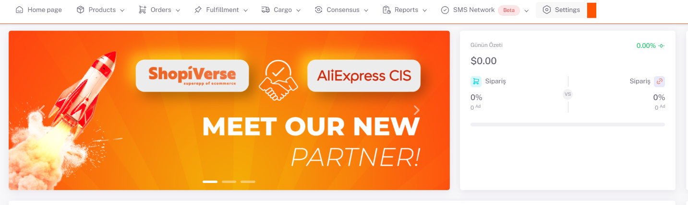
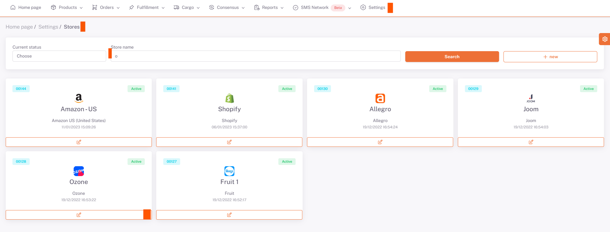

# Ozone API Integration

For **Ozone** API integration; We need to fill in the “`Client ID`” and “`Api Key`” information under **Settings > Stores > Ozone > API Definition** from the ShopiVerse panel.

## Settings

## Stores > Ozone

 
## Ozone > API Definition

## Client ID - To Get API Key

Client ID - To Get API Key
  We add the number in the “**Client ID**” field under the address https://seller.ozon.ru/app/settings/api-keys to the “**Client ID**” section.

We write "**ShopiVerse**" in the Key Generating field under *Token Type* and click Generate Key, and we enter the *Api Key* number there in the "**Api Key**" field in the *ShopiVerse* panel.

After entering the information in the ShopiVerse API definition field, we click **Save**. After this process, the **Request Authorization** button becomes active, by clicking this button, the user logs in to the Ozone panel, the requested information is allowed, and our api integration connection with Ozon is completed. .