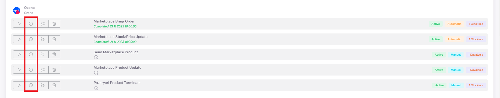

# Ozone Business Plans

## Ozone > Business Plan

After **category matching, variant matching, product content and price adjustments** are made for *Ozon*, you can select ***relevant business plans*** *Manually/Automatically* on the **Settings > Stores > Ozon > Business Plan** page. You need to specify and activate it.

## Settings > Business Plan

After doing this, the "**Send Product to Marketplace**" business plan under the Ozon tab under **Settings > Business Plan** is run with the run button with *side triangle symbol*. After this business plan is completed, the “**Marketplace Stock/Price Update**” business plan is run in the same way.

  You need to review the product-based error messages given as errors or warnings as a result of the business plans, make the necessary corrections and re-run the business plan. You can see the transaction history by clicking the button in the red area below. After these processes, the products sent successfully according to the results of the business plans enter the moderation process in Ozon and when they are approved, your products are successfully put up for sale.

  

:::caution
You need to review the product-based error messages given as errors or warnings as a result of the business plans, make the necessary corrections and re-run the business plan.

After these processes, the products sent successfully according to the results of the business plans enter the moderation process in Ozon and when they are approved, your products are successfully put up for sale.
:::