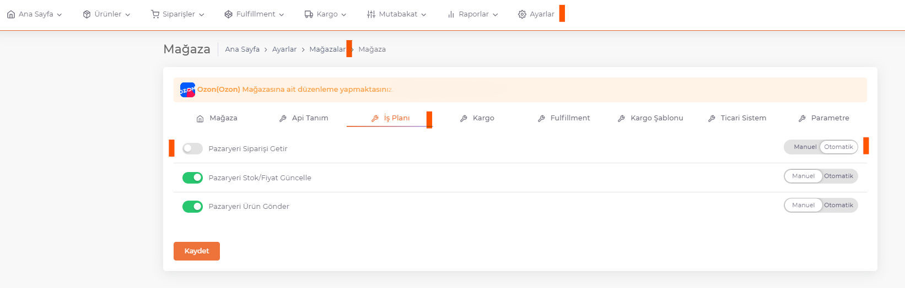
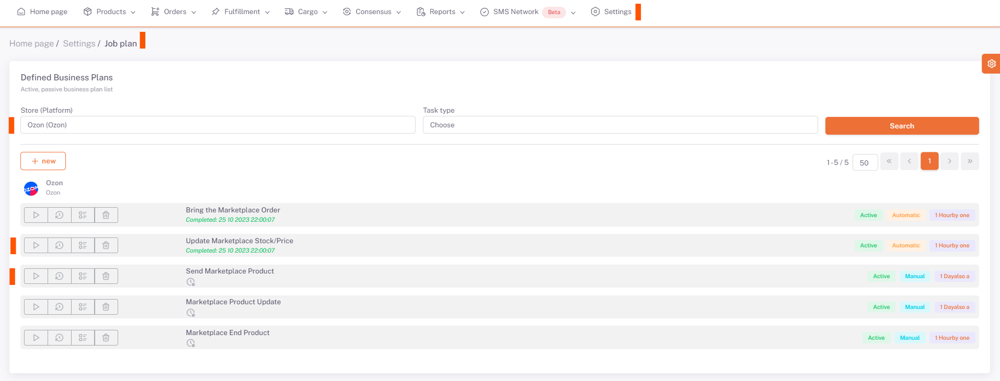

# Ozone Business Plans

## Ozone > Business Plan

After making **category matching, variant matching, product content and price adjustments** for *Ozone*, you can *Manually/Automatically* set the ***related business plans*** on **Settings > Stores > Ozone > Business Plan** page. You need to set it and activate it.

## Settings > Business Plan

After performing this operation, the "**Send Products to Marketplace**" business plan under the Ozone tab under **Settings > Business Plan** is run with the run button with the *side triangle symbol*. After this business plan is completed, the "**Marketplace Stock/Price Update**" business plan is run in the same way.

:::caution
As a result of the work plans, you should review the product-based error messages that are given as errors or warnings and make the necessary corrections and run the work plan again.

After these processes, the products that are sent successfully according to the results of the business plans enter the moderation process in Ozon and when they are approved, your products are successfully opened for sale.
:::