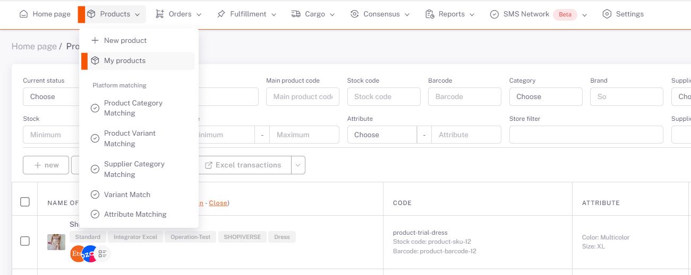
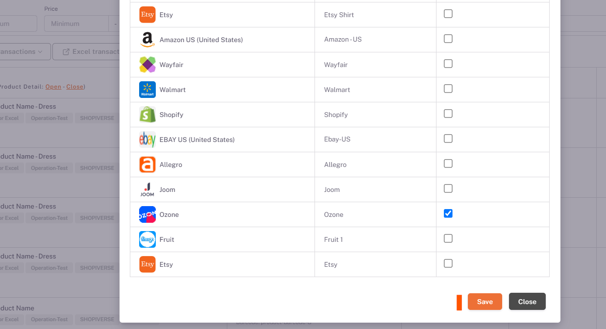
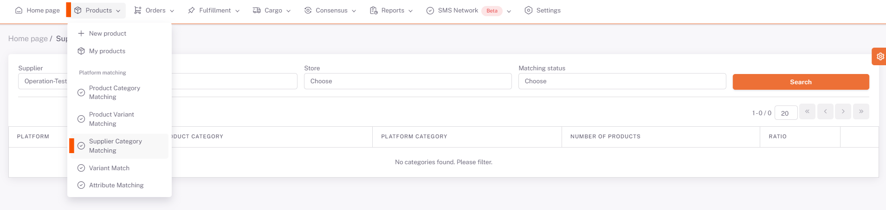
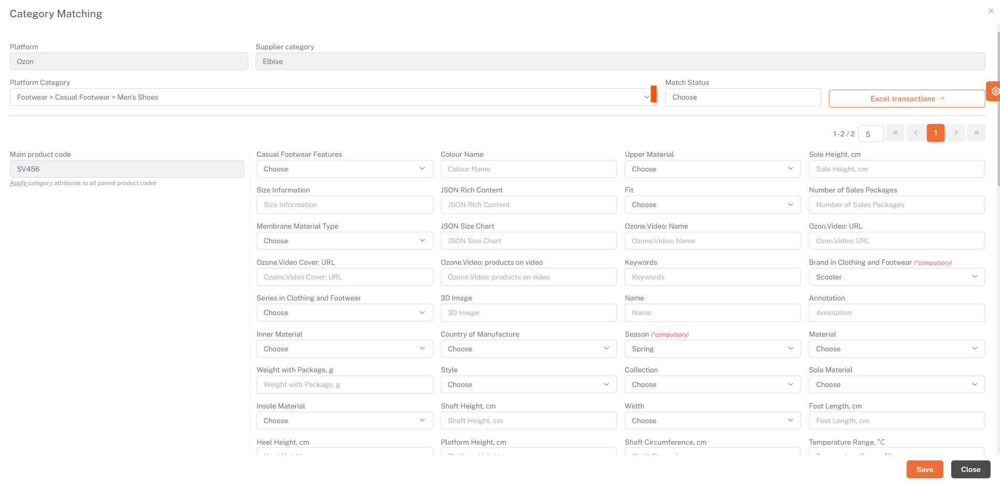

# Ozone Category Matching

## Products > My Products

On the *My Products* page, **products that you want to be offered for sale in *Ozone* are selected or filtered**. Then, under **Platform Operations**, “**Publish Selected Products**” or “**Publish Filtered Products**” option is selected and Ozone is selected on the pop-up page and Save is done.

## Category Matching

Then the **Products > Platform Matching > Supplier Category Matching** page opens, *Ozone* is selected from the *Store* field and the categories of your products that you have selected as available for sale are listed below.

We open the category matching page with the edit button on the right side of the relevant category. You need to select the category that corresponds to your category written in the Supplier Category field in the Platform Category field here, or the category that is closest.

After selecting the category, your products and value fields requested by the platform are listed below on the basis of the Main Product Code. In order for your products to be available for sale, you must fill in the "**Required**" values for each Main Product Code. After filling in these fields, we complete the category matching in all categories and products by clicking save.

## Excel Operations
In case you do not want to make the matches one by one, click "download **Excel Template**" under excel operations in the right field and enter the information written under the "**Property Value Code**" in the "**Category Properties**" sheet in the required value fields in Excel. You must save by correctly filling them in the columns corresponding to the Main Product Codes. After you have prepared the Excel, you can perform the upload process on the same page in the ShopiVerse panel by saying “**Select File**” under excel operations, selecting the relevant excel and saying “**Upload Excel Template**”.

