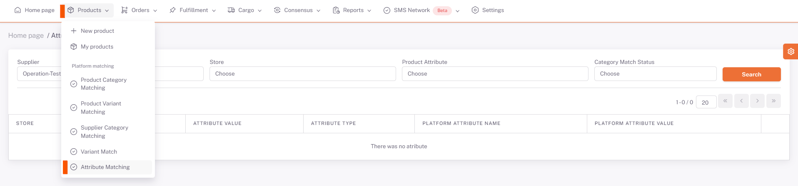
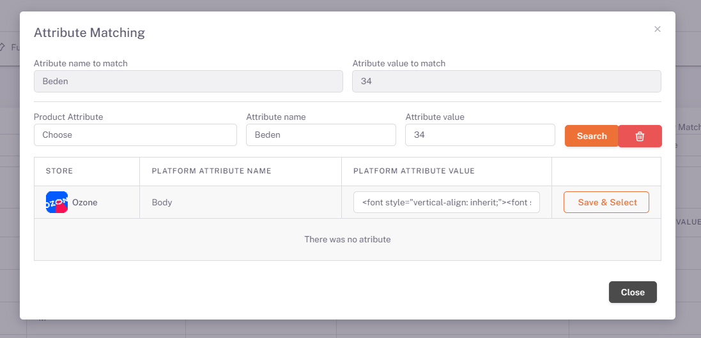

# Ozone Attribute Matching

## Attribute Matching

After the *Category matching* is completed, the **Products > Platform Matching > Attribute Matching** page opens. Joom is selected from the store area and color and size information with attribute values are listed below.

## Edit

We open the attribute matching page with the edit button on the right of the relevant attribute value. On the page opened with the edit button corresponding to the Attribute Value field here, reset the values with the "**Clear**" button and say "**Search**" and select the appropriate value from the corresponding attribute value offered by the platform, and this is done for each attribute value.

