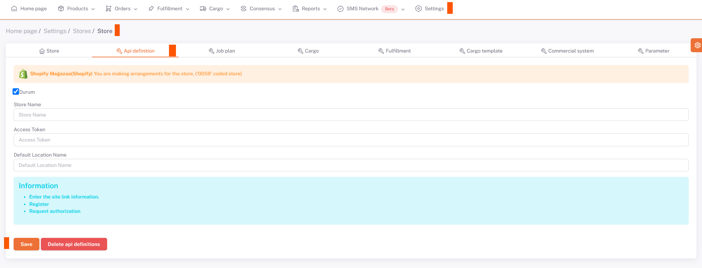

# Shopify API Integration

For **Shopify** API integration; https://www.shopify.com/partners login.**“App”** from the left menu, then **“Create an app”** at the top right** “*ShopiVerse*” by typing “*ShopiVerse*” in the *App name* field Click on “Create app**” button. The values of “**API Key**” and “**Api Key Secret**” given on the screen are saved in the database as marketplace parameters.

We need to fill in the "**Store Name**" field under **Settings > Stores > Shopify > API Definition** from the ShopiVerse panel.

## Settings

 
## Stores > Shopify

## Shopify > API Definition
