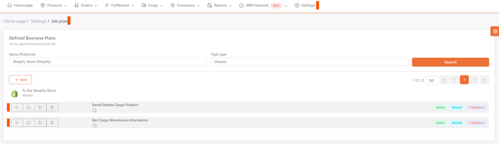

# Shopify Business Plans

After making *category matching, variant matching, product content and price adjustments* for Shopify, you need to set the ***related business plans*** as *Manual/Auto* on the **Settings > Stores > Shopify > Business Plan** page and activate it. required.

## Settings > Business Plan

After doing this, the business plan "**Related** activated on the Stores Page" under the Shopify tab under **Settings > Business Plan** is run with the run button with the side triangle symbol.

:::caution

The business plans on the business plan page are the business plans activated from the stores, if they are not activated, check them again from the stores.

:::