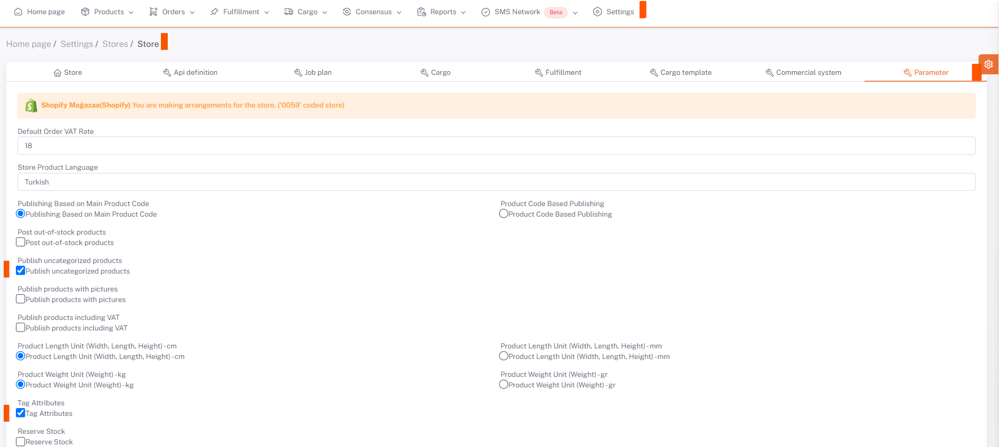

# Shopify Category Matching

## Shopify Parameters

Click on the store parameters screen in **Shopiverse Panel > Settings > Stores > Shopify**.

With **Tag Attributes**, attribute values are tagged and sent to the platform.

:::caution
Then, it should be ensured that the products are sent to the platform **without category matching, with the label in the product information**. Products without tags are not sent.
:::

It is necessary to bring the categories in the **platform** by running **“bring a platform category”** *business plan* for the products to be sent by category.

## Category Matching

After the categories are pulled from the platform, category matching can be done on the **Shopiverse Panel > Products > Platform Matching > Supplier Category Matching** page.

**Shopify** is selected from the **Store** field and the categories of your products that you have selected as available for sale are listed below.

We open the category matching page with the edit button on the right side of the relevant category. You need to select the category that corresponds to your category written in the Supplier Category field in the Platform Category field here, or the category that is closest.

After selecting the category, your products and value fields requested by the platform are listed below on the basis of the Main Product Code. In order for your products to be available for sale, you must fill in the "**Required**" values for each Main Product Code. After filling in these fields, we complete the category matching in all categories and products by clicking save.