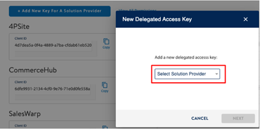

# Wallmart API Integration

## Wallmart
Go to https://developer.walmart.com url.

You can log in via the **My Account** button.

In the **Production Keys** tab, the **Add New Key** button is clicked.

Service selection is made on the screen that opens. **ShopiVerse** is selected from the listed services.

All authorizations on the screen are approved and saved.

## Client ID - Client Secret

The **Client Id and Client Secret** information obtained from here are saved in the Api Definition tab in the ShopiVerse store settings.

## Api Definition

