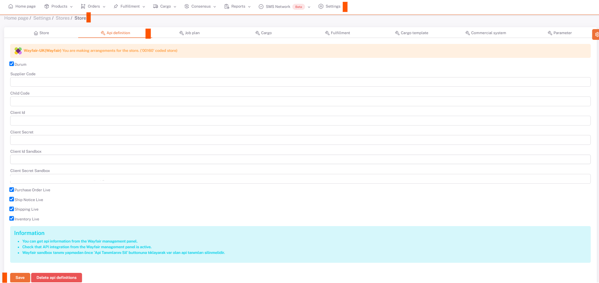

# Wayfair API Integration

In the **Wayfair** panel, go to the ***Developer > Applications*** page.
*Name and Description* fields are filled on **New Application**. ***ShopiVerse*** information is entered in these fields.

Here, we need to create 2 records, one as **sandbox** and the other as **production**.

After creation, you must log in via the **Edit** field and copy the **key** information after pressing the **Client ID and Rotate Secret** button and save it to the relevant places under the ***Wayfair store > Api Definition*** field on *ShopiVerse* required.

## Client ID - Client Secret

